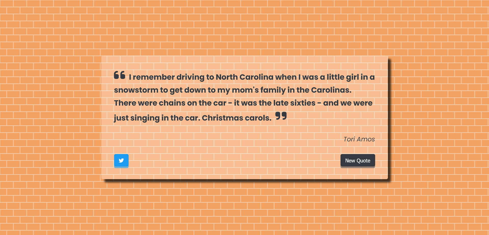

# Random Quote Generator

    

<a href="https://noasalgado.github.io/Random-Quote-Generator/">Live Demo </a>

## About The Project

This simple app allows you to obtain different famous phrases that gets from an api. It`s also possible to share the quotes through twitter

## Built With

- HTML 5
- CSS
- JavaScript

## Resources Used

- [Quotes Api](https://jacintodesign.github.io/quotes-api/data/quotes.json) - API
- [Google Fonts](https://fonts.google.com/knowledge) - Typography
- [FontAwesome](https://fontawesome.com/) - Icons
- [Hero Patterns](https://heropatterns.com/) - Background
